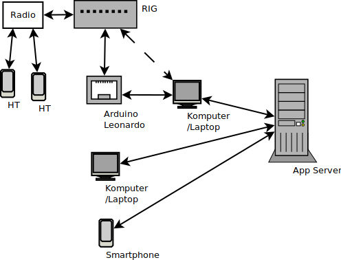

# Latar belakang

Saat ini komunikasi dengan media internet telah banyak digunakan untuk menggantikan komunikasi dengan media konvensional. Masyarakat umum telah mulai terbiasa memanfaatkan layanan voice-over-IP seperti whatsapp-call dan skype. Layanan-layanan VOIP tersebut umumnya lebih murah dan praktis. Pengguna hanya perlu menginstall aplikasi yang dibutuhkan di smartphone atau komputer mereka.

Adapun demikian, komunikasi internet tidak sepenuhnya bisa menggantikan media komunikasi lain. Di tempat-tempat terpencil seringkali pengguna sama sekali tidak bisa menggunakan internet. Pengadaan sarana seperti tower komunikasi dan sebagainya juga dirasa tidak sebanding dengan jumlah pengguna layanan yang tidak terlalu banyak.

Oleh sebab itu, protokol komunikasi radio masih menjadi alternatif utama dalam misi-misi militer dan SAR. Radio memiliki jangkauan komunikasi yang cukup luas dengan biaya pengadaan sarana yang tidak terlalu mahal. Pengguna dapat menggunakan perangkat HT untuk berkomunikasi dengan pengguna lain yang memiliki frekuensi radio sama.

Namun demikian, tidak bisa dipungkiri bahwa radio memiliki daya jangkau yang terbatas. Berbeda dengan internet yang telah memiliki jaringan global, peletakan repeater dan router untuk memperluas jangkauan radio justru akan meningkatkan biaya infrastruktur.

Untuk mengatasi kelemahan pada komunikasi internet dan radio, maka beberapa vendor seperti Galaxy PTT Comms, AllStar Link, BroadNet, IRLP, dan EchoLink telah berusaha mengimplementasikan radio-over-IP (ROIP). Dengan adanya ROIP, seseorang dapat berkomunikasi dengan memanfaatkan media radio dan internet sekaligus.

Namun sayang, beberapa protokol ROIP yang ditawarkan bersifat komersial dan tertutup. Dengan demikian seorang pengguna terpaksa harus dibatasi pada satu produk tertentu.

Dalam penelitian ini akan dibuat prototipe komunikasi ROIP dengan memanfaatkan web-rtc, web-usb, arduino, dan perangkat RIG. Implementasi yang ada akan bersifat open source dan bisa dikembangkan lebih jauh sesuai kebutuhan.

# Landasan Teori

## ROIP

## Web-RTC

## Web-USB

## Arduino

# Implementasi

# Kesimpulan

# Referensi
* http://comtekk.us/roip.htm
* https://wicg.github.io/webusb/
* https://webrtc.org/
