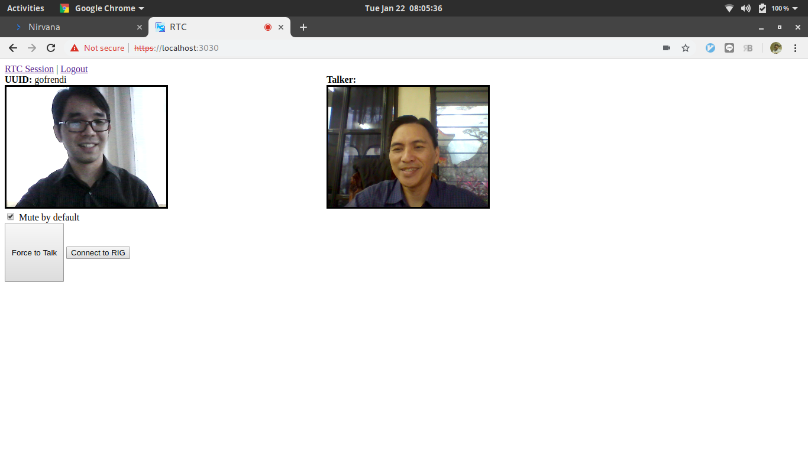

# Judul

Prototipe ROIP dengan menggunakan Web-RTC, Web-USB, dan Arduino-Leonardo

# Latar belakang

Saat ini komunikasi dengan media internet telah banyak digunakan untuk menggantikan komunikasi dengan media konvensional. Masyarakat umum telah mulai terbiasa memanfaatkan layanan voice-over-IP seperti whatsapp-call dan skype. Layanan-layanan VOIP tersebut umumnya lebih murah dan praktis. Pengguna hanya perlu menginstall aplikasi yang dibutuhkan di smartphone atau komputer mereka.

Adapun demikian, komunikasi internet tidak sepenuhnya bisa menggantikan media komunikasi lain. Di tempat-tempat terpencil seringkali pengguna sama sekali tidak bisa menggunakan internet. Pengadaan sarana seperti tower komunikasi dan sebagainya juga dirasa tidak sebanding dengan jumlah pengguna layanan yang tidak terlalu banyak.

Oleh sebab itu, protokol komunikasi radio masih menjadi alternatif utama dalam misi-misi militer dan SAR. Radio memiliki jangkauan komunikasi yang cukup luas dengan biaya pengadaan sarana yang tidak terlalu mahal. Pengguna dapat menggunakan perangkat HT untuk berkomunikasi dengan pengguna lain yang memiliki frekuensi radio sama.

Namun demikian, tidak bisa dipungkiri bahwa radio memiliki daya jangkau yang terbatas. Berbeda dengan internet yang telah memiliki jaringan global, peletakan repeater dan router untuk memperluas jangkauan radio justru akan meningkatkan biaya infrastruktur.

Untuk mengatasi kelemahan pada komunikasi internet dan radio, maka beberapa vendor seperti Galaxy PTT Comms, AllStar Link, BroadNet, IRLP, dan EchoLink telah berusaha mengimplementasikan radio-over-IP (ROIP). Dengan adanya ROIP, seseorang dapat berkomunikasi dengan memanfaatkan media radio dan internet sekaligus.

Namun sayang, beberapa protokol ROIP yang ditawarkan bersifat komersial dan tertutup. Dengan demikian seorang pengguna terpaksa harus dibatasi pada satu produk tertentu.

Dalam penelitian ini akan dibuat prototipe komunikasi ROIP dengan memanfaatkan web-rtc, web-usb, arduino, dan perangkat RIG. Implementasi yang ada akan bersifat open source dan bisa dikembangkan lebih jauh sesuai kebutuhan.

# Landasan Teori

## ROIP

ROIP (Radio Over IP Protocol) adalah suatu protokol untuk mengemulasikan radio dua arah menggunakan jaringan IP. Bisa dikatakan, ROIP adalah VOIP yang diberi kapabilitas PTT (Push-to-talk). Kapabilitas PTT ini menyebabkan jika salah satu radio berbicara, maka radio-radio yang lain hanya bisa mendengar. Beberapa vendor seperti Galaxy PTT Comms, AllStar Link, BroadNet, IRLP, dan EchoLink telah berusaha mengimplementasikan ROIP dalam produk-produk mereka.

## Web-RTC

Web RTC (Web Real Time Communication) adalah protokol untuk bertukar informasi video/audio secara real-time. Web-RTC memanfaatkan peer-to-peer connection. Artinya, data video/audio dihantarkan langsung ke client lain tanpa perlu melewati server perantara. Adapun demikian, Web-RTC masih membutuhkan signaling server (STUN). STUN server tersebut bertugas sebagai client-discovery service. Artinya saat satu client ingin menghubungi client lain, STUN server akan memberikan lokasi client yang bersangkutan.

Di samping STUN server, Web-RTC juga membutuhkan TURN server. TURN server ini bertugas untuk menyediakan fall-back communication medium. Artinya, jika komunikasi peer-to-peer tidak dimungkinkan (semisal client berada di balik firewall), maka TURN server inilah yang akan bertugas sebagai perantara. Dalam kondisi ideal, TURN server seharusnya tidak dibutuhkan.

## Web-USB

Web USB API adalah standar komunikasi untuk mengekspos perangkat USB di web. Web USB sangat berguna untuk kepentingan IOT. Web USB memungkinkan seorang developer untuk membuat sebuah halaman web yang dapat mengakses perangkat USB client secara langsung tanpa perlu adanya third-party library. Salah satu browser yang mendukung Web-USB API adalah google-chrome.

## Arduino

Arduino adalah papan mikrokontroler berbasis atmega yang telah memiliki beraneka ragam fitur untuk memudahkan proses development. Arduino biasa dipakai untuk kepentingan prototyping. Pemrograman arduino juga relatif mudah karena menggunakan bahasa pemrograman C yang sudah banyak dikenal.

# Implementasi


Dalam penelitian ini, dibuat dua buah program untuk pembuktian konsep. Program pertama diletakkan di application-server, sedangkan program kedua diletakkan pada arduino sebagai penghubung antara komputer dan RIG.

## Program Application Server

Program application-server dibuat dengan menggunakan framework Node.js dan beberapa library seperti koa, socket.io, serta webRTC adapter. Selain menginisiasi komunikasi RTC, program application-server juga berfungsi untuk menerima dan mem-broadcast sinyal PTT dari client. Beberapa end-point yang di-ekspose oleh application server antara lain:

* `/`: Digunakan untuk tampilan utama web-RTC serta mengirimkan sinyal PTT.
* `/login`: Digunakan untuk login.
* `/logout`: Digunakan untuk logout.
* `/register`: Digunakan untuk mendaftar sebagai pengguna baru.
* `/user-list`: Digunakan untuk menampillkan daftar pengguna.


Usecase diagram application server


Antarmuka manage user



RTC session


Setting RIG + HTT

# Program Arduino

Program kedua adalah interface arduino untuk menghubungkan laptop dan RIG. Kode program pada aplikasi kedua adalah sebagai berikut:

```c
    #include <WebUSB.h>
    #define Serial WebUSBSerial
    WebUSB WebUSBSerial(1, "roiptim.com/playground");

    int led = 13;
    int btn = 12;
    int heartBeat = 0;

    void setup() {
      pinMode(led, OUTPUT);
      pinMode(btn, INPUT);
      Serial.begin(9600);
      while(!Serial.available()) {
        delay(10);
      }
    }

    void loop() {
      if (heartBeat == 10) {
        heartBeat = 0;
        int pressed = digitalRead(btn);
        if (pressed) {
          Serial.print(1); Serial.flush(); // send `1` to client if the button is pressed
        } else {
          Serial.print(0); Serial.flush(); // send `0` to client if the button is not pressed
        }
        // if client request is complete and the command is correct, turn on the lamp. Valid command is either `0` or `1`.
        int input = Serial.read();
        if (input == 1 || input == 0) {
          digitalWrite(led, input);
        }
      }
      heartBeat++;
    }
```

Secara umum program ini berfungsi untuk membaca dan mengirim sinyal PTT dari perangkat RIG ke server atau sebaliknya. Pembacaan dilakukan setiap sepuluh kali perulangan.

# Kesimpulan

Secara umum teknologi Web-RTC dan Web-USB serta arduino dapat dimanfaatkan untuk implementasi ROIP. Adapun demikian, masih ada keterbatasan antara lain banyaknya jumlah client yang bisa terhubung secara bersamaan sangat tergantung pada bandwidth dari masing-masing client.

# Referensi
* https://github.com/goFrendiAsgard/webrtc
* http://comtekk.us/roip.htm
* https://wicg.github.io/webusb/
* https://webrtc.org/
